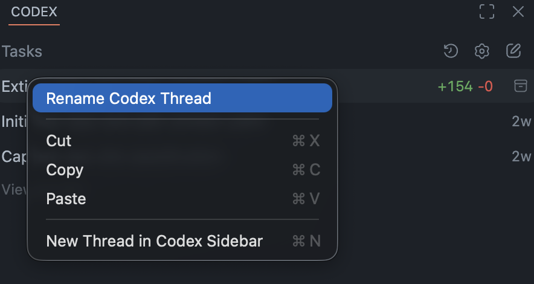
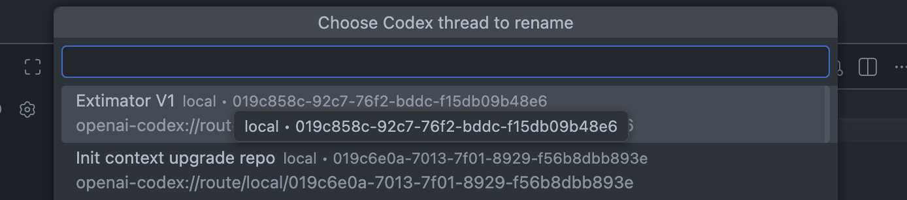

# Codex Thread Renamer Patcher VS Code Extension


Patch the installed VS Code `openai.chatgpt` extension so you can rename Codex threads from the UI.

## Important

This project **modifies the installed OpenAI ChatGPT/Codex VS Code extension files on your machine**.

- It patches the extension manifest/runtime/webview loader.
- It adds injected patch files used by the rename feature.
- It creates timestamped backups before writing changes.

Use `verify` before `apply`, and reapply after updating the OpenAI extension.

## Visual Preview

### Right-click rename action in Codex thread list



### Choose thread to rename (Command Palette flow)



## What It Adds

- `Rename Codex Thread` command in the Command Palette
- Right-click `Rename Thread` action in the Codex thread list
- Live title updates in the open Codex UI
- Persistent rename via Codex backend rename RPC
- Cache patching fallback so stale titles do not come back

## Quick Start

```bash
node bin/codex-thread-renamer-patch.js status
node bin/codex-thread-renamer-patch.js verify
node bin/codex-thread-renamer-patch.js apply
```

Then restart the VS Code window or run `Developer: Restart Extension Host`.

## Usage

After patching and reloading VS Code:

1. Open the Codex sidebar.
2. Rename a thread using either:
   - Command Palette -> `Rename Codex Thread`
   - Right-click a thread title -> `Rename Thread`

## Commands

- `status` - Check whether the installed extension appears patched
- `verify` - Validate extension signatures before patching
- `apply` - Apply the patch and write backups

Optional flags:

- `--extension-dir <path>` - Target a specific `openai.chatgpt-*` install folder
- `--dry-run` - Show what would change without writing files

## Docs

- Technical internals: `docs/how-it-works.md`
- Testing and troubleshooting: `docs/testing-and-troubleshooting.md`
- Release history: `CHANGELOG.md`

## Known Issue

- Canceling the rename prompt currently shows:
  - `Codex rename patch: Rename cancelled.`
- This is a UX issue only, it is tracked and documented in `CHANGELOG.md`.

## License

See `LICENSE`.
